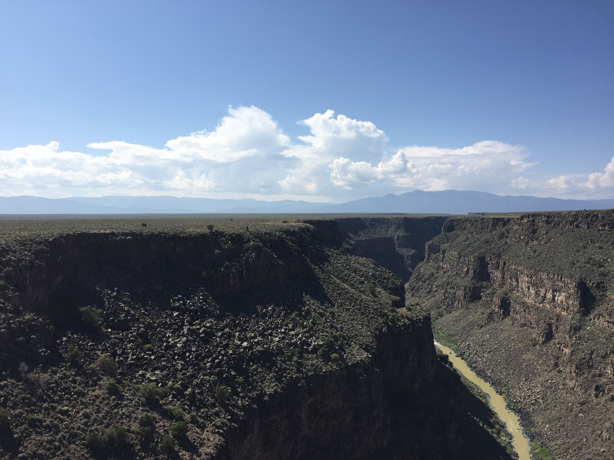

```{r setup, include=FALSE}
knitr::opts_chunk$set(echo = TRUE)
```

Welcome to my website! This page has been created as part of the coursework for BIOL 381 Computational Biology at UVM. Find links to homework assignments for said class below.


[Homework #2 page](Homework_02.html)

[Homework #3 page](Homework_03.html)

[Homework #4 page](Homework_04.html)

[Homework #5 page](Homework_05.html)

[Homework #6 page](Homework_06.html)

