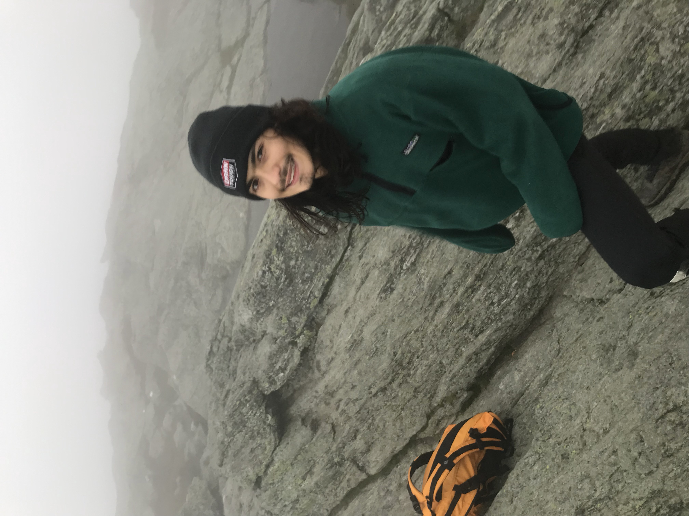
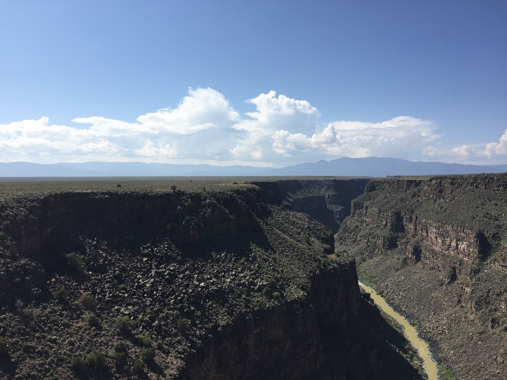

```{r setup, include=FALSE}
knitr::opts_chunk$set(echo = TRUE)
```

Welcome to my website! This page has been created as part of the coursework for BIOL 381 Computational Biology at UVM. Find links to homework assignments for said class below.

<style>
.pic {
  max-width: 30%;
}
</style>

[Homework #2 page](Homework_02.html)

[Homework #3 page](Homework_03.html)


[Homework #4 page](Homework_04.html)

[Homework #5 page](Homework_05.html)

[Homework #6 page](Homework_06.html)

[Homework #7 page](Homework_07.html)

[Homework #8 page](Homework_08.html)

[Homework #9 page](Homework_09.html)

[Homework #10 page](Homework_10.html)

[Homework #11 page](Homework_11.html)

[Homework #12 page](Homework_12.html)



P.S. If anyone knows how to *properly* format, place, or add captions to images in R markdown, please let me know! Took a lot of guessing and checking to get my photo placed on the top right of the webpage like that, and I'm sure there must be a better way to do it!